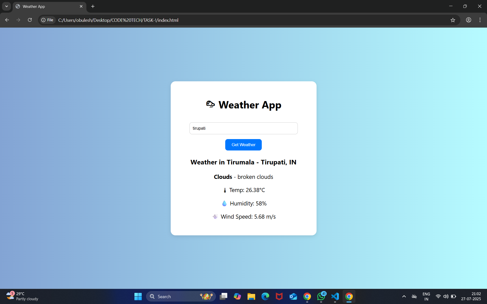

# Weather-API Integration
# 🌐 CODTECH Technologies - Weather Webpage Project
---

## 👨‍💻 Internship Details

- **Intern Name**: Obulesu Polisetti
- **Intern ID**: CT08DG2167  
- **Internship Program**: Full Stack Web Development Internship  
- **Organization**: [CODTECH Technologies](https://codtech.in)  
- **Task Number**: Task-1 – API Integration  
- **Project Title**: API Integration 
- **Duration**: 17 June 2025 – 17 August 2025 

---


## 📌 Project Name
**CODTECH TASK-1: Responsive Webpage to Fetch and Display Public API Data Iintegration**

---

## 🧾 Description

This project is a part of the **CODTECH Technologies** internship task. It demonstrates how to develop a **responsive web page** that dynamically fetches and displays data from a **public API**. In this example, we use the **OpenWeatherMap API** to display real-time weather data for a user-specified city.

---

## 🚀 Features

- 🌍 Fetches live weather data using OpenWeatherMap API  
- 📱 Fully responsive design for mobile, tablet, and desktop  
- ⚡ Fast and interactive user experience  
- 🔍 Input-based city weather lookup  
- ❌ Handles invalid input and error cases gracefully

---
   
## 🛠 Tech Stack

- **HTML5**  
- **CSS3**  
- **JavaScript (ES6+)**  
- **OpenWeatherMap API**

---

## 📷 Screenshots

## 🌤️ Weather App Preview




---

## 🚀 Live Demo

🔗 [View Live Weather App](https://obulesu-weatherapp.netlify.app)


---

## 🔑 How to Use

### 1. Clone the Repository

```bash
git clone https://github.com/OBULESH597/Weather-API.git
cd codtech-weather-task
